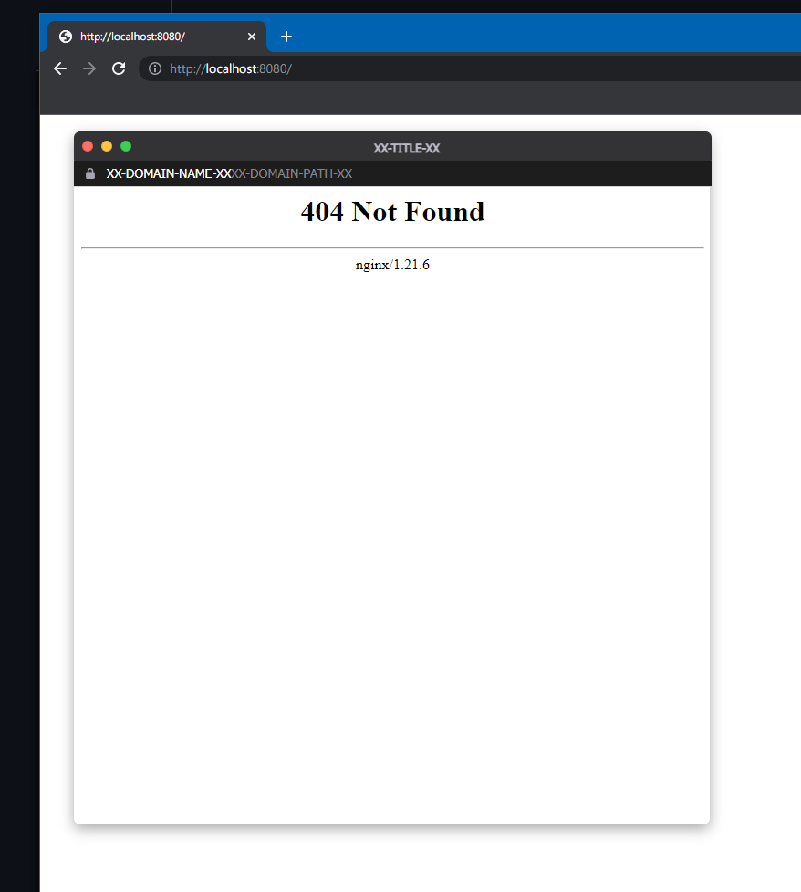
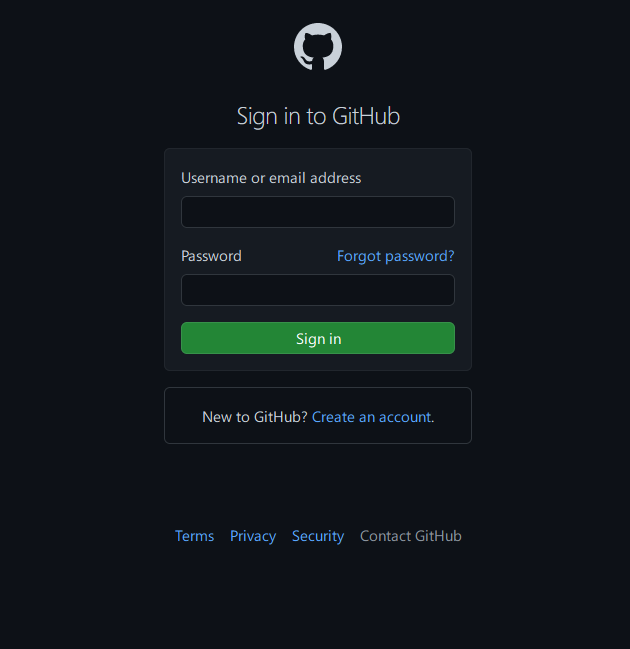
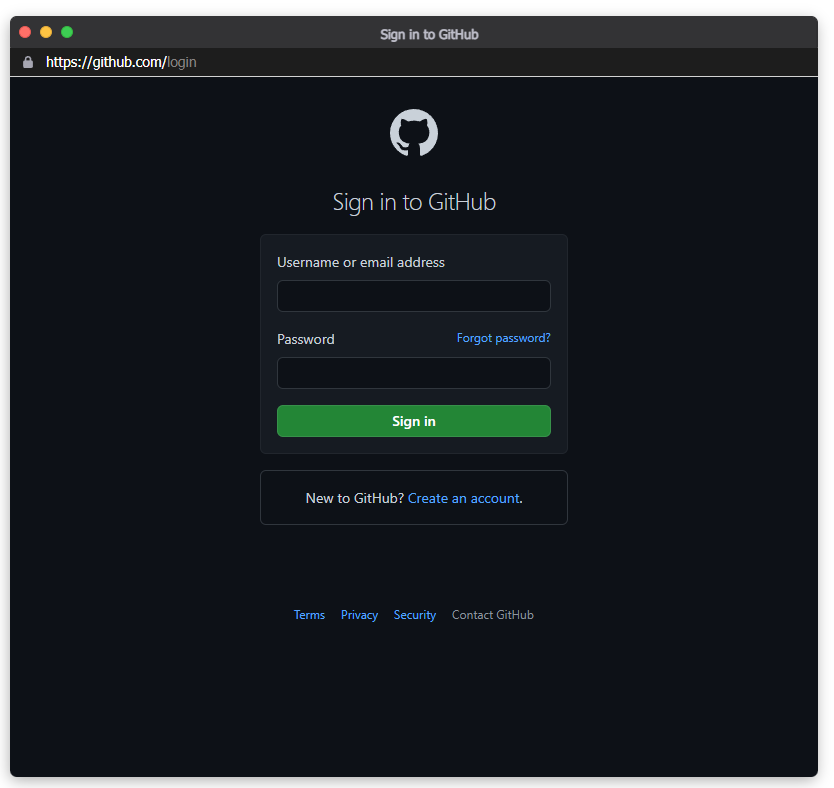
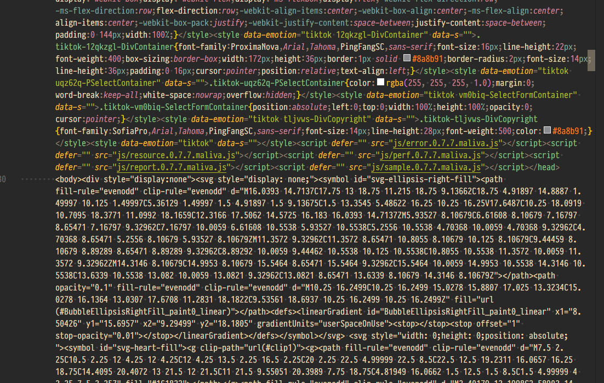
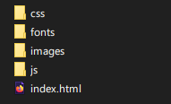

# Teaching-HEIGVD-SEN-2022-Laboratoire-BITB


## Une petite note sur l'éthique

Il n'est absolument pas acceptable d'attaquer quelqu'un pour quelque raison que ce soit.

L'utilisation de ces outils à des fins autres que votre propre éducation et formation sans autorisation est strictement interdite par les politiques de ce cours et de l'école, ainsi que par les lois.

Le but de cet exercice est de vous permettre de vous familiariser avec les outils et comment ils peuvent être utilisés dans le contexte professionnel d'un pentest. Ça vous permettra aussi de comprendre les tactiques de l'adversaire afin de pouvoir les contrer par le biais de la politique, de l'éducation et de la formation.


## Introduction

Selon le [Internet Crime Report 2020](https://www.ic3.gov/Media/PDF/AnnualReport/2020_IC3Report.pdf) rendu publique par le Centre de plaintes pour les crimes sur Internet du FBI, le phishing est de loin l'attaque la plus courante des cybercriminels. En effet, on enregistre plus de deux fois plus d'incidents de phishing que tout autre type de criminalité informatique.

La raison est simple : une attaque par phishing ne nécessite pas forcément des connaissances techniques très sophistiquées ni un grand nombre de ressources.

Depuis l’apparition du terme « phishing » en 1995, la technique a évolué avec l’Internet. Les premières tentatives de phishing visaient le vol d’information et d’identité. Pourtant, les efforts se sont rapidement concentrés autour du vol d’argent. Le premier incident contre un système de paiement en ligne a été enregistré en 2001 et la première attaque contre une banque en 2003. Les choses n’ont pas beaucoup changé après 20 ans. 

Il est pourtant très facile d’identifier un site de phishing. Il suffit de regarder la barre d’adresse du navigateur ! (oui… il y a de méthodes qui utilisent un DNS pour contourner ces « détails » mais ça implique un travail considérable et un accès souvent local à la cible). Un coup d’œil à l’adresse du site suffit normalement pour dévoiler une attaque… 

Ce n’est plus le cas… 

En mars 2022, une nouvelle attaque baptisée [Browser in the Browser](https://mrd0x.com/browser-in-the-browser-phishing-attack/) propose d’utiliser JavaScript pour construire une fenêtre d’authentification capable de spoofer pas seulement les éléments visuels d’un site légitime, mais aussi le nom du domaine d'un fournisseur d'autnetification. Cette interface prend la forme d'une fenêtre émergente/flottante.

Il est clair que le site qui contient/lance cette fenêtre aura une adresse facilement identifiable comme étant pas légitime. Il faut donc comprendre le scénario d'utilisation de cet outil : un attaquant peut créer un site/service qui attire les victimes avec la promesse, par exemple, d'un cadeau. La seule condition pour obtenir le cadeau c'est la création d'un compte sur le site pour faciliter la livraison dudit cadeau. Pour cela, et pour faciliter la vie de la personne qui participe, le site met à disposition l'authentification de Google, ou Microsoft, ou Apple ou Facebook... ce qui est courant de nos jours. Au lieu de créer un compte de zéro pour chaque nouveau service, on utilise juste un fournisseur d'authentification. Pas besoin donc d'un username ou mot de passe, entre autres. Le site propose donc des icônes pour les différents services d'authentification disponibles. La cible clique sur l'icône du service authentification préféré et une fenêtre émergente demande les credentials de Google ou Microsoft ou Apple ou Facebook, etc... Sauf que cette fenêtre est un clone controlé par un attaquant.

Le résultat, c’est quelque chose comme ceci :


La fenêtre émergente/flottante que vous voyez sur l’animation est un clone ; ce n’est pas une vraie authentification Microsoft. Vous remarquerez également l’URL de la fenêtre, qui semble tout à fait légitime. Le domaine ```login.microsoftonline.com``` est bien le domaine réel appartenant à Microsoft pour l’authentification.

## Que faut-il faire ?

Voici les activités à réaliser dans ce laboratoire. Vous devez :

- Installer un serveur Web pour héberger votre attaque. Nous vous proposons une solution basée sur ```nginx``` et ```Docker```
- Télécharger les sources de l’attaque [BITB](https://github.com/mrd0x/BITB)
- Comprendre le fonctionnement et les différents paramètres 
- Implémenter votre attaque avec le site/système d’authentification de votre choix.

Le "rapport" de ce labo est très simple : **Pour chaque tâche, faites des captures d'écran de vos activités et répondez les éventuelles questions**.

## Docker Web Server

Nous allons utiliser une solution simple mais efficace utilisant l’[image Docker officielle du serveur nginx]( https://hub.docker.com/_/nginx). 

Vous pouvez lancer votre serveur à l’aide de la commande suivante :

```bash
docker run --name nginx -v /votre/site:/usr/share/nginx/html -p 8080:80 -d nginx
```

Ceci crée un container basé sur l’image ```nginx``` qui utilise le contenu du répertoire ```/votre/site``` comme homepage. Le port pour accéder au site depuis votre navigateur est le ```8080```. Vous pouvez évidement le modifier s'il est déjà utilisé par une autre application sur votre machine.


## Browser In The Browser Attack

Dans un répertoire de votre choix, clonez [le projet BITB disponible sur github](https://github.com/mrd0x/BITB). Par exemple :

```bash
git clone https://github.com/mrd0x/BITB.git
```
Le projet contient une série de répertoires qui génèrent des versions de fenêtres differentes en fonction de l’OS de la cible (windows ou macos). Des versions « dark » et « light » sont aussi proposées pour chaque OS. Il est possible de déterminer quelle version doit être montrée à la victime utilisant JavaScript. Vous pouvez même déterminer si la cible utilise dark ou light mode comme expliqué [ici](https://stackoverflow.com/questions/50840168/how-to-detect-if-the-os-is-in-dark-mode-in-browsers).

Dans mon cas (macos, dark), je lance mon container Docker depuis le répertoire ```BITB``` de la manière suivante :

```bash
docker run --name bitb-nginx -v $PWD/MacOS-Chrome-DarkMode:/usr/share/nginx/html -p 8080:80 -d nginx
```
Voici ce que j’obtiens comme résultat. Cette fenêtre est "flottante"; je peux donc la déplacer avec ma souris :


---
#### Livrable : Capture d'écran de votre première fenêtre de BITB


---

Cette fenêtre est une manière assez utile de comprendre tout de suite les paramètres à configurer. Ces éléments sont facilement identifiables puisqu'ils prennent la forme ```XX-ELEMENT-A-CONFIGURER-XX```. Chacun de ces éléments correspond à une variable dans le fichier ```index.html``` de chaque répertoire (pour les différentes versions). Les variables à éditer sont donc les suivantes :

- XX-TITLE-XX - Le titre de la fenêtre
- XX-DOMAIN-NAME-XX - Le nom de domaine spoofé 
- XX-DOMAIN-PATH-XX - Le chemin (path) pour le domaine
- XX-PHISHING-LINK-XX - Le lien de phishing qui sera inséré dans votre fenêtre

Le fichier ```logo.svg``` dans le même répertoire vous permet de spoofer le logo du domaine. Il n'est pas visible sur la version Mac mais sur la version Windows uniquement. Vous pouvez changer le fichier ou éditer son nom dans ```index.html```.

Je procède à modifier les 3 premiers variables de la version Windows light. Je trouve aussi rapidement un logo correspondant à Outlook et voici le résultat :


Vous pouvez voir que la fenêtre affiche maintenant l'adresse du service Outlook de l'école. Le message "Coming soon" vient tout simplement du fait que j'ai juste utilisé un fichier html avec le message en question. Je n'ai pas préparé un site de phishing... ceci est votre travail !

## Phishing Link

On arrive à la partie la moins triviale de l'exercice : vous devez donc implémenter votre attaque avec le site/système d’authentification de votre choix. En d'autres termes, vous allez produire votre "phishing link" pour la dernière variable du fichier ```ìndex.html```. Vous pouvez tenter de faire l'expérience avec le webmail de l'école, mais ça peut être plus intéressant avec un service qui utilise vraiment une fenêtre flottante/émergente (un exemple c'est Twitter). Vous aurez très probablement besoin d'un outil pour "aspirer"/cloner la fenêtre d'authentification que vous allez représenter ou vous pouvez essayer de la reproduire manuellement, ce qui sera plus ou moins facile à faire en fonction de l'objectif choisi. Il se peut que le site aspiré ne soit pas utilisable directement sans un peu de travail. A vous de voir. 

Votre travail pour ce TP sera limité à afficher la fenêtre avec le formulaire. La fonctionnalité pour récolter les credentials ne doit pas être implémentée. 

Evidement, ce travail peut être combiné avec des outils comme [Gophish](https://github.com/gophish/gophish/releases), ce qui risque de produire des résultats redoutables.

---
#### Livrable : Capture d'écran du site légitime que vous avez cloné.


---

#### Livrable : Capture d'écran de votre version.


---

#### Question : quels sont les valeurs que vous avez attribués aux différentes variables ?

<table>
<tr>
<th>Variable</th>
<th>Valeur</th>
<th>Remarque</th>
</tr>
<tr>
<td>XX-TITLE-XX</td>
<td>Sign in to GitHub</td>
<td>Comme il s'agit de la page de login de GitHub, je n'avais pas forcément d'idée plus pertinente que de rajouter le même titre que la page.</td>
</tr>
<tr>
<td>XX-DOMAIN-NAME-XX</td>
<td>https://github.com</td>
<td></td>
</tr>
<tr>
<td>XX-DOMAIN-PATH-XX</td>
<td>/login</td>
<td></td>
<tr>
<td>XX-PHISHING-LINK-XX</td>
<td>github-login.html</td>
<td>Il m'a fallut un petit moment pour comprendre qu'on pouvait simplement rajouter une page html entière comme lien dans l'attribut `src` de la balise `iframe`.</td>
</tr>
</table>

---

#### Question : Y-a-t'il des différences remarquables entre le site original et votre version ? Si oui, lesquelles ?

À priori, non, on n'arrive pas à distinguer la différence entre les deux sites
d'un premier coup d'œil. Si on décide de s'attarder sur des détails comme la
police, on peut apercevoir une légère différence de luminosité et la forme qui
n'est pas exactement pareil. Mais ceci peut être dû soit à la manière avec
laquelle est rendue l'`iframe`, soit la taille entre le site de base et le BITB.

---
#### Question : quel outil ou méthode avez-vous employé pour cloner le formulaire qui s'affiche sur votre fenêtre ? Comment avez-vous procédé ? Donnez-nous le plus grand nombre de détails possibles !

##### Recherche d'un outils

Après de longues recherches et concertation avec des anciens potes de cours,
j'ai finalement pu découvrir un website scraper open source
[website-scraper-puppeteer](https://github.com/website-scraper/website-scraper-puppeteer),
un plugin pour
[website-scraper](https://github.com/website-scraper/node-website-scraper) qui
permet de prendre en charge des sites dynamiques.

##### Installation

Donc dans un premier temps, il a fallu mettre à jour nodejs et npm. Puis, lancer la commande

```bash
npm install website-scraper website-scraper-puppeteer
```

##### Recherche d'un site

Comme je voulais faire quelque chose que j'ai considéré comme particulier, je
voulais faire la page de TikTok, mais j'ai assez vite déchanté quand j'ai vu
l'état du fichier `index.html` qui semble avoir subit une compilation le rendant
par conséquent difficilement lisible.

J'ai bien tenté de commencer à mettre les choses en place, mais confronté à
cette horreur (excuser moi du peu), j'ai plus ou moins abandonné l'idée car le
travail aurait été bien trop conséquent pour le rendu final.



Mais pour un travail plus avancer avec une version où on devrait récupérer les
credentials entrés par l'utilisateur, c'est une page de choix à recopier (même
si on y trouve toutes sortes d'expert, aussi en physique qu'en informatique,
donc pas tout le monde tomberait dans le panneau).

Je me suis donc rabattu sur GitHub, qui était bien plus simple à mettre en
place, mais je n'ai malheureusement pas réussi à trouver une page qui fait appel
à un `OAuth` de GitHub, donc il y a simplement la page de login dans la fenêtre.

##### Utilisation

J'ai directement utilisé l'exemple fourni sur le repo GitHub de
website-scraper-puppeteer en changeant la variable `urls` et `directory` et j'ai
enregistré dans un fichier sobrement nommé `index.js`.

```js
import scrape from 'website-scraper';
import PuppeteerPlugin from 'website-scraper-puppeteer';

await scrape({
    urls: ['https://github.com/login'],
    directory: 'github',
    plugins: [ 
      new PuppeteerPlugin({
        launchOptions: { headless: false }, /* optional */
        scrollToBottom: { timeout: 10000, viewportN: 10 }, /* optional */
        blockNavigation: true, /* optional */
      })
    ]
});
```

et ensuite de lancé

```bash
node index.js
```

pour être agressé par une erreur de nodejs

```bash
(node:4262) Warning: To load an ES module, set "type": "module" in the package.json or use the .mjs extension.
/home/{user}/dev/node/scrapper/index.js:1
import {scrape} from 'website-scraper';
^^^^^^

SyntaxError: Cannot use import statement outside a module


    at Object.compileFunction (node:vm:352:18)
    at wrapSafe (node:internal/modules/cjs/loader:1033:15)
    at Module._compile (node:internal/modules/cjs/loader:1069:27)
    at Module._extensions..js (node:internal/modules/cjs/loader:1159:10)
    at Module.load (node:internal/modules/cjs/loader:981:32)
    at Module._load (node:internal/modules/cjs/loader:827:12)
    at Function.executeUserEntryPoint [as runMain] (node:internal/modules/run_main:77:12)
    at node:internal/main/run_main_module:17:47

Node.js v18.2.0
```

Donc il fallait encore créer un fichier `package.json` avec pour contenu 

```json
{
    "type": "module"
}
```

et de relancer l'exécution pour être accueilli par

```bash
reject(new Errors_js_1.TimeoutError(`Timed out after ${timeout} ms while trying to connect to the browser! Only Chrome at revision r${preferredRevision} is guaranteed to work.`));
                   ^

TimeoutError: Timed out after 30000 ms while trying to connect to the browser! Only Chrome at revision r982053 is guaranteed to work.
```

Moi qui pensait que ça serait plus simple, il a donc fallu que j'installe une
version de Google Chrome dans ma distribution Linux

```bash
wget https://dl.google.com/linux/direct/google-chrome-stable_current_amd64.deb
sudo dpkg -i google-chrome-stable_current_amd64.deb
sudo apt -f install
```

pour installer le paquet et ses dépendances. Et le plus drôle, c'est que quand
website-scraper-puppeteer est lancé en « headless », il n'a même pas utilisé
Google Chrome, mais Chromium que j'avais déjà d'installé[^1].

[^1]: Quelle indignité…

Mais pour finir, ceci a téléchargé (apparemment) le contenu de la page Web qu'on
peut voir dans l'image ci-dessous.



Il ne restait donc plus qu'à intégrer la page de login dans l'`iframe` et le
tour était joué[^2].

[^2]: Pfiou, c'était long et pas pour les bonnes raisons.

---
#### Pour finir, partagez avec nous vos conclusions.

À force de regarder des vidéos du YouTubers
[Sandoz](https://www.youtube.com/c/Sandozprod), où on voit des broutteurs[^3]
profiter de la faiblesse des moins avertis, je me rends compte qu'une attaque du
genre, surtout avec quelqu'un d'inexpérimenté, pourrait faire de sérieux dégât,
et peut-être même mener au sui*ide de la victime.

[^3]: C'est ainsi que sont désignés les arnaqueurs.

Elle constitue donc, si la personne décide d'aller au bout des choses, de copier
au pixel près les pages de login, et concevoir un vrai site Web derrière cette
page, une stratégie tout à fait viable pour toutes personnes qui voudrait voler
aux gens (ou autre action légalement répréhensible).

---

## Echeance

Le 12 mai 2022 à 10h25
