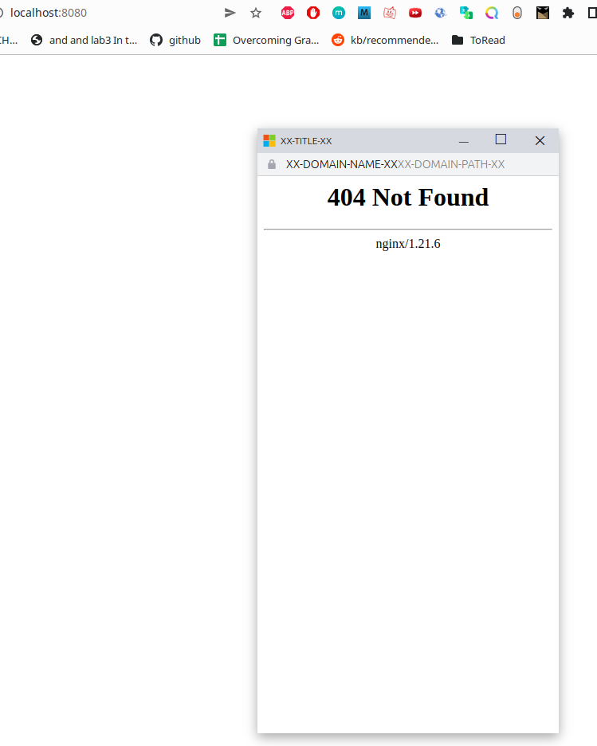
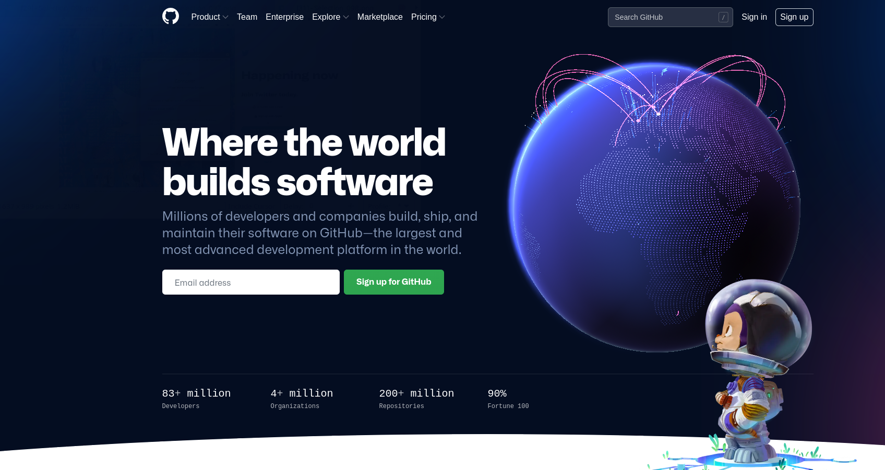
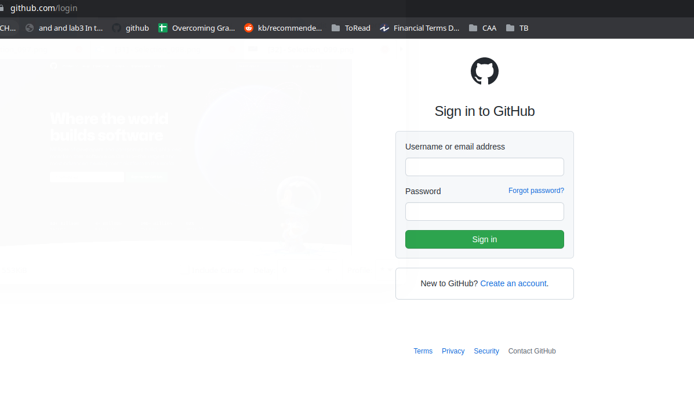
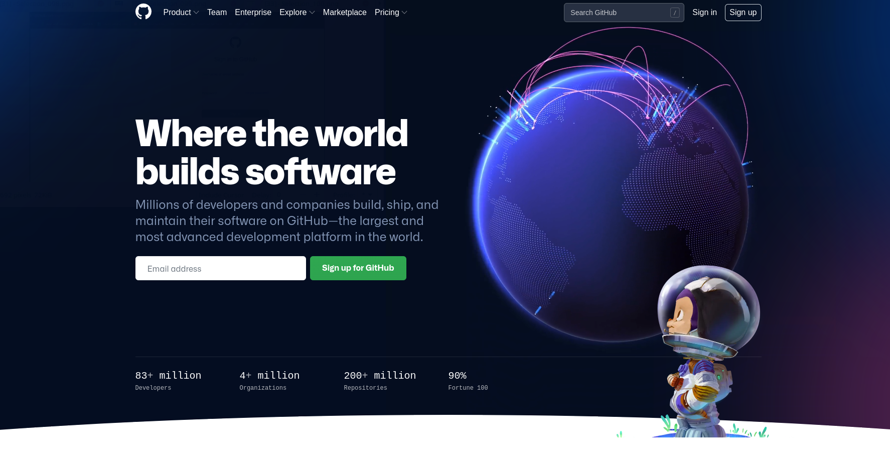
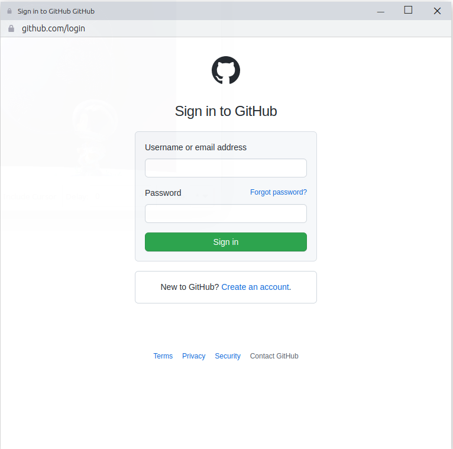

Lucas Gianinetti
___

# Teaching-HEIGVD-SEN-2022-Laboratoire-BITB


## Une petite note sur l'éthique

Il n'est absolument pas acceptable d'attaquer quelqu'un pour quelque raison que ce soit.

L'utilisation de ces outils à des fins autres que votre propre éducation et formation sans autorisation est strictement interdite par les politiques de ce cours et de l'école, ainsi que par les lois.

Le but de cet exercice est de vous permettre de vous familiariser avec les outils et comment ils peuvent être utilisés dans le contexte professionnel d'un pentest. Ça vous permettra aussi de comprendre les tactiques de l'adversaire afin de pouvoir les contrer par le biais de la politique, de l'éducation et de la formation.


## Introduction

Selon le [Internet Crime Report 2020](https://www.ic3.gov/Media/PDF/AnnualReport/2020_IC3Report.pdf) rendu publique par le Centre de plaintes pour les crimes sur Internet du FBI, le phishing est de loin l'attaque la plus courante des cybercriminels. En effet, on enregistre plus de deux fois plus d'incidents de phishing que tout autre type de criminalité informatique.

La raison est simple : une attaque par phishing ne nécessite pas forcément des connaissances techniques très sophistiquées ni un grand nombre de ressources.

Depuis l’apparition du terme « phishing » en 1995, la technique a évolué avec l’Internet. Les premières tentatives de phishing visaient le vol d’information et d’identité. Pourtant, les efforts se sont rapidement concentrés autour du vol d’argent. Le premier incident contre un système de paiement en ligne a été enregistré en 2001 et la première attaque contre une banque en 2003. Les choses n’ont pas beaucoup changé après 20 ans. 

Il est pourtant très facile d’identifier un site de phishing. Il suffit de regarder la barre d’adresse du navigateur ! (oui… il y a de méthodes qui utilisent un DNS pour contourner ces « détails » mais ça implique un travail considérable et un accès souvent local à la cible). Un coup d’œil à l’adresse du site suffit normalement pour dévoiler une attaque… 

Ce n’est plus le cas… 

En mars 2022, une nouvelle attaque baptisée [Browser in the Browser](https://mrd0x.com/browser-in-the-browser-phishing-attack/) propose d’utiliser JavaScript pour construire une fenêtre d’authentification capable de spoofer pas seulement les éléments visuels d’un site légitime, mais aussi le nom du domaine d'un fournisseur d'autnetification. Cette interface prend la forme d'une fenêtre émergente/flottante.

Il est clair que le site qui contient/lance cette fenêtre aura une adresse facilement identifiable comme étant pas légitime. Il faut donc comprendre le scénario d'utilisation de cet outil : un attaquant peut créer un site/service qui attire les victimes avec la promesse, par exemple, d'un cadeau. La seule condition pour obtenir le cadeau c'est la création d'un compte sur le site pour faciliter la livraison dudit cadeau. Pour cela, et pour faciliter la vie de la personne qui participe, le site met à disposition l'authentification de Google, ou Microsoft, ou Apple ou Facebook... ce qui est courant de nos jours. Au lieu de créer un compte de zéro pour chaque nouveau service, on utilise juste un fournisseur d'authentification. Pas besoin donc d'un username ou mot de passe, entre autres. Le site propose donc des icônes pour les différents services d'authentification disponibles. La cible clique sur l'icône du service authentification préféré et une fenêtre émergente demande les credentials de Google ou Microsoft ou Apple ou Facebook, etc... Sauf que cette fenêtre est un clone controlé par un attaquant.

Le résultat, c’est quelque chose comme ceci :


La fenêtre émergente/flottante que vous voyez sur l’animation est un clone ; ce n’est pas une vraie authentification Microsoft. Vous remarquerez également l’URL de la fenêtre, qui semble tout à fait légitime. Le domaine ```login.microsoftonline.com``` est bien le domaine réel appartenant à Microsoft pour l’authentification.

## Que faut-il faire ?

Voici les activités à réaliser dans ce laboratoire. Vous devez :

- Installer un serveur Web pour héberger votre attaque. Nous vous proposons une solution basée sur ```nginx``` et ```Docker```
- Télécharger les sources de l’attaque [BITB](https://github.com/mrd0x/BITB)
- Comprendre le fonctionnement et les différents paramètres 
- Implémenter votre attaque avec le site/système d’authentification de votre choix.

Le "rapport" de ce labo est très simple : **Pour chaque tâche, faites des captures d'écran de vos activités et répondez les éventuelles questions**.

## Docker Web Server

Nous allons utiliser une solution simple mais efficace utilisant l’[image Docker officielle du serveur nginx]( https://hub.docker.com/_/nginx). 

Vous pouvez lancer votre serveur à l’aide de la commande suivante :

```bash
docker run --name nginx -v /votre/site:/usr/share/nginx/html -p 8080:80 -d nginx
```

Ceci crée un container basé sur l’image ```nginx``` qui utilise le contenu du répertoire ```/votre/site``` comme homepage. Le port pour accéder au site depuis votre navigateur est le ```8080```. Vous pouvez évidement le modifier s'il est déjà utilisé par une autre application sur votre machine.


## Browser In The Browser Attack

Dans un répertoire de votre choix, clonez [le projet BITB disponible sur github](https://github.com/mrd0x/BITB). Par exemple :

```bash
git clone https://github.com/mrd0x/BITB.git
```
Le projet contient une série de répertoires qui génèrent des versions de fenêtres differentes en fonction de l’OS de la cible (windows ou macos). Des versions « dark » et « light » sont aussi proposées pour chaque OS. Il est possible de déterminer quelle version doit être montrée à la victime utilisant JavaScript. Vous pouvez même déterminer si la cible utilise dark ou light mode comme expliqué [ici](https://stackoverflow.com/questions/50840168/how-to-detect-if-the-os-is-in-dark-mode-in-browsers).

Dans mon cas (macos, dark), je lance mon container Docker depuis le répertoire ```BITB``` de la manière suivante :

```bash
docker run --name bitb-nginx -v $PWD/MacOS-Chrome-DarkMode:/usr/share/nginx/html -p 8080:80 -d nginx
```
Voici ce que j’obtiens comme résultat. Cette fenêtre est "flottante"; je peux donc la déplacer avec ma souris :


---
#### Livrable : Capture d'écran de votre première fenêtre de BITB
---



Cette fenêtre est une manière assez utile de comprendre tout de suite les paramètres à configurer. Ces éléments sont facilement identifiables puisqu'ils prennent la forme ```XX-ELEMENT-A-CONFIGURER-XX```. Chacun de ces éléments correspond à une variable dans le fichier ```index.html``` de chaque répertoire (pour les différentes versions). Les variables à éditer sont donc les suivantes :

- XX-TITLE-XX - Le titre de la fenêtre
- XX-DOMAIN-NAME-XX - Le nom de domaine spoofé 
- XX-DOMAIN-PATH-XX - Le chemin (path) pour le domaine
- XX-PHISHING-LINK-XX - Le lien de phishing qui sera inséré dans votre fenêtre

Le fichier ```logo.svg``` dans le même répertoire vous permet de spoofer le logo du domaine. Il n'est pas visible sur la version Mac mais sur la version Windows uniquement. Vous pouvez changer le fichier ou éditer son nom dans ```index.html```.

Je procède à modifier les 3 premiers variables de la version Windows light. Je trouve aussi rapidement un logo correspondant à Outlook et voici le résultat :


Vous pouvez voir que la fenêtre affiche maintenant l'adresse du service Outlook de l'école. Le message "Coming soon" vient tout simplement du fait que j'ai juste utilisé un fichier html avec le message en question. Je n'ai pas préparé un site de phishing... ceci est votre travail !

## Phishing Link

On arrive à la partie la moins triviale de l'exercice : vous devez donc implémenter votre attaque avec le site/système d’authentification de votre choix. En d'autres termes, vous allez produire votre "phishing link" pour la dernière variable du fichier ```ìndex.html```. Vous pouvez tenter de faire l'expérience avec le webmail de l'école, mais ça peut être plus intéressant avec un service qui utilise vraiment une fenêtre flottante/émergente (un exemple c'est Twitter). Vous aurez très probablement besoin d'un outil pour "aspirer"/cloner la fenêtre d'authentification que vous allez représenter ou vous pouvez essayer de la reproduire manuellement, ce qui sera plus ou moins facile à faire en fonction de l'objectif choisi. Il se peut que le site aspiré ne soit pas utilisable directement sans un peu de travail. A vous de voir. 

Votre travail pour ce TP sera limité à afficher la fenêtre avec le formulaire. La fonctionnalité pour récolter les credentials ne doit pas être implémentée. 

Evidement, ce travail peut être combiné avec des outils comme [Gophish](https://github.com/gophish/gophish/releases), ce qui risque de produire des résultats redoutables.

---
#### Livrable : Capture d'écran du site légitime que vous avez cloné.
---
Page d'accueil de github:



Page du login:




#### Livrable : Capture d'écran de votre version.
---

Page d'accueil clonée:



Au final le cas de github n'est pas parfaitement adapté à la situation car une fenêtre dédiée est utilisée pour le signin et non un popup. Mais il suffit d'adapter à un exemple ou le sign in fait montrer un popup, j'ai essayé avec twitter mais je n'arrivais pas a cloner le site.

Page de sign in clonée :



#### Question : quels sont les valeurs que vous avez attribués aux différentes variables ?

```
Réponse : 
- XX-TITLE-XX - Le titre de la fenêtre
    - Sign in to GitHub GitHub
- XX-DOMAIN-NAME-XX - Le nom de domaine spoofé 
    - github.com/login
- XX-DOMAIN-PATH-XX - Le chemin (path) pour le domaine
    - [laissé vide]
- XX-PHISHING-LINK-XX - Le lien de phishing qui sera inséré dans votre fenêtre```
    - login.html
---

#### Question : Y-a-t'il des différences remarquables entre le site original et votre version ? Si oui, lesquelles ?

```
Réponse : 
* Sur la page d'accueil du site original on peut scroll vers le bas et voir d'autres informations générales. Sur mon site j'ai enlevé cette partie et seule la partie visible au chargement de la page est affichée.
* Si on clique sur les autres liens que le sign in il ne se passe rien ou il y a une erreur
* Si on clique sur Sign in (celui de la page de Sign in) il y a une erreur
```

---
#### Question : quel outil ou méthode avez-vous employé pour cloner le formulaire qui s'affiche sur votre fenêtre ? Comment avez-vous procédé ? Donnez-nous le plus grand nombre de détails possibles !

```
Réponse : J'ai utilisé l'outil webhttrack pour cloner la page d'accueil et la page de login. Il suffit d'accéder à l'interface web du logiciel, d'y indiquer l'url du site à cloner. Comme option pour le clonage j'ai indiqué "Get individual file".

Ensuite j'ai modifiée le fichier index.html de la page d'accueil clonée. Dans le lien correspondant au bouton Sign in, j'y ai indiqué le fichier bitb qui lui ensuite contient la référence au fichier login.html qui est le login cloné de github.
```

---
#### Pour finir, partagez avec nous vos conclusions.

```
Conclusions : Il est relativement facile de cloner un site pour faire du phishing si l'on imagine que la cible va effectuer l'action de login directement. Dans le cas ou la cible va effectuer une action qu'on attend pas (ce qui est hautement probable), il est nécessaire d'imiter les autres fonctionnalités du site (par exemple la création de compte, l'affiche d'informations générales que le site propose, etc) ce qui va tout de suite prendre beaucoup plus de temps.
```
---

## Echeance

Le 12 mai 2022 à 10h25
